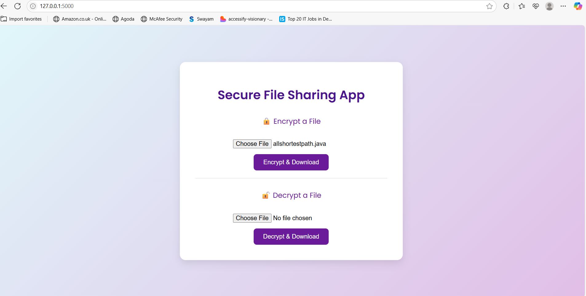
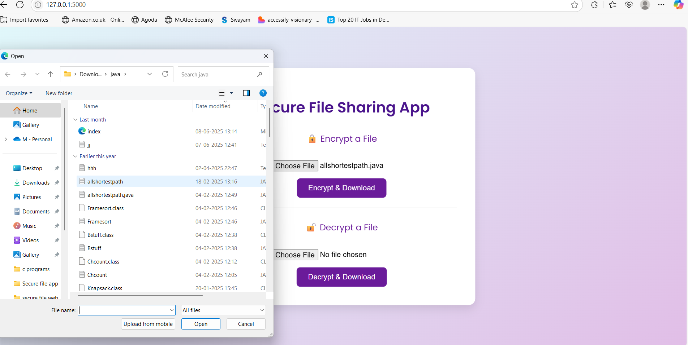
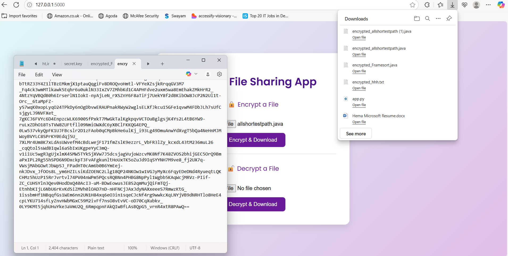
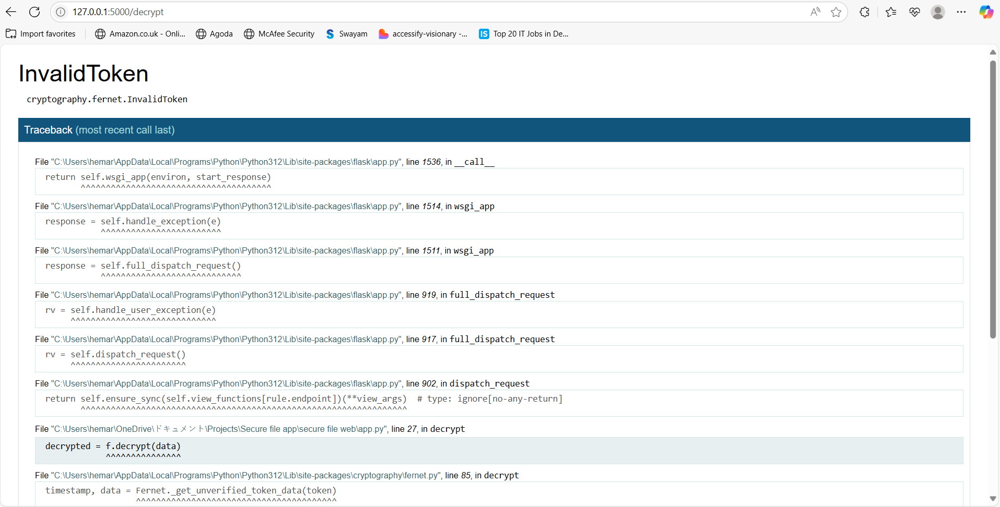

# Secure File Sharing Web App 🔒

A simple, professional web application for encrypting and decrypting files securely using AES encryption.

## 🌟 Features

✅ Upload any file and encrypt it with AES  
✅ Decrypt previously encrypted files  
✅ Clean, responsive UI  
✅ Built with Python, Flask, and Cryptography

## 🚀 How to run

1. Install dependencies:
   ```bash
   pip install flask cryptography

Generate your encryption key:

python -c "from cryptography.fernet import Fernet; open('secret.key','wb').write(Fernet.generate_key())"

Start the server:

python app.py
Open http://127.0.0.1:5000/ in your browser.
## 🌐 Live Demo

[🔗 Click here to see the UI on GitHub Pages](https://hemapravallika24.github.io/secure-file-web/)


👩‍💻 Author

Hema Pravallika


---

✅ Copy the whole block above, including the starting `# Secure File Sharing Web App 🔒` down to the last line.  
✅ Paste it into your new `README.md` file in your `secure-file-web` folder.  
✅ Save the file.  
✅ Then commit & push with:
```bash
git add README.md
git commit -m "Add project README"
git push


## 📸 Screenshots

### 🔹 Main Page



### 🔹 Success Message

